Deep learning (DL) techniques are increasingly being utilized in MRI processing, showing significant effectiveness in tasks such as image reconstruction, segmentation, and super-resolution. These methods leverage large datasets and advanced algorithms to predict and mitigate electromagnetic interference (EMI). By learning complex patterns of interference, DL models can adaptively filter out noise, providing a flexible and scalable approach to EMI elimination. However, supervised learning, which is commonly applied for ULF MRI EMI reduction, has some notable drawbacks. It typically requires a substantial amount of ground truth data for training and is highly sensitive to domain shift issues, where the model's performance degrades when applied to data from different distributions. 

This project (named SUPERCLEAN) proposed a novel self supervised learning technique that addresses these challenges. 
This approach aims to reduce the dependency on large training datasets and improve robustness against domain shifts, 
ensuring more reliable EMI mitigation in ULF MRI systems. 
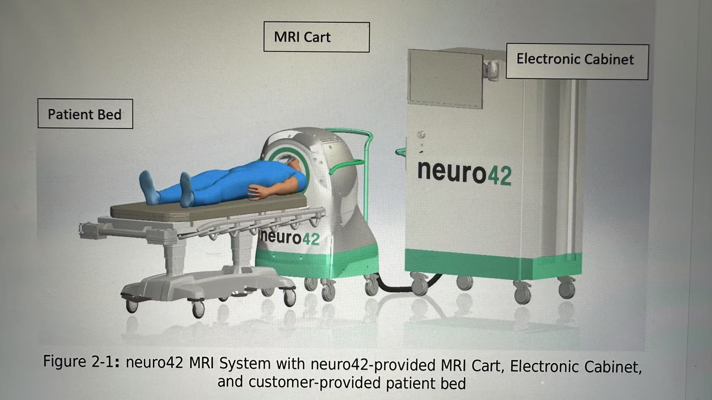 

Neural networks trained on extensive MRI data, 
including both nuclear magnetic resonance (NMR) signals and EMI signatures, can accurately distinguish between true MRI signals and interference, 
thereby enhancing the quality of MRI images. The following figure is the network architecture of SUPERCLEAN.

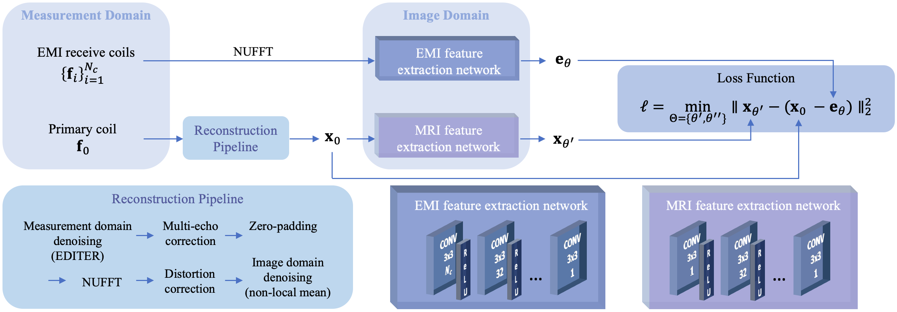  

The following images shows the noise suppression results comparing to original images and images after reconstruction pipeline.
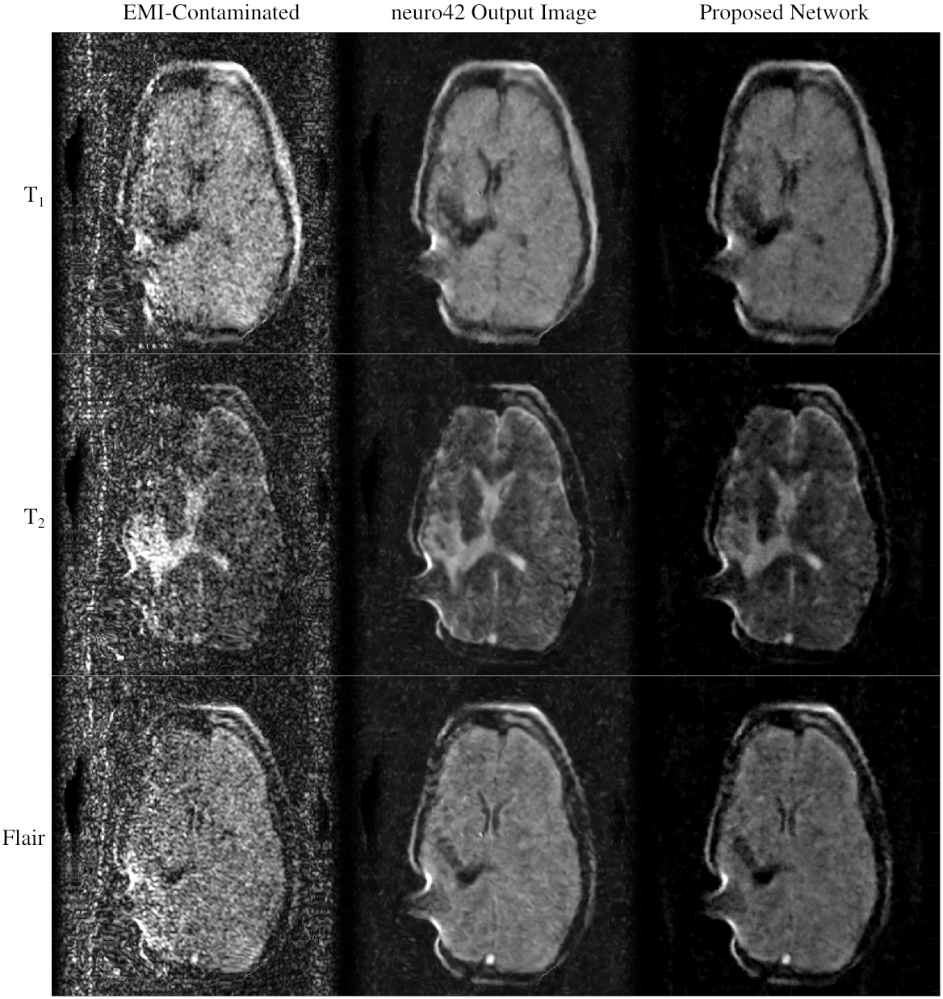  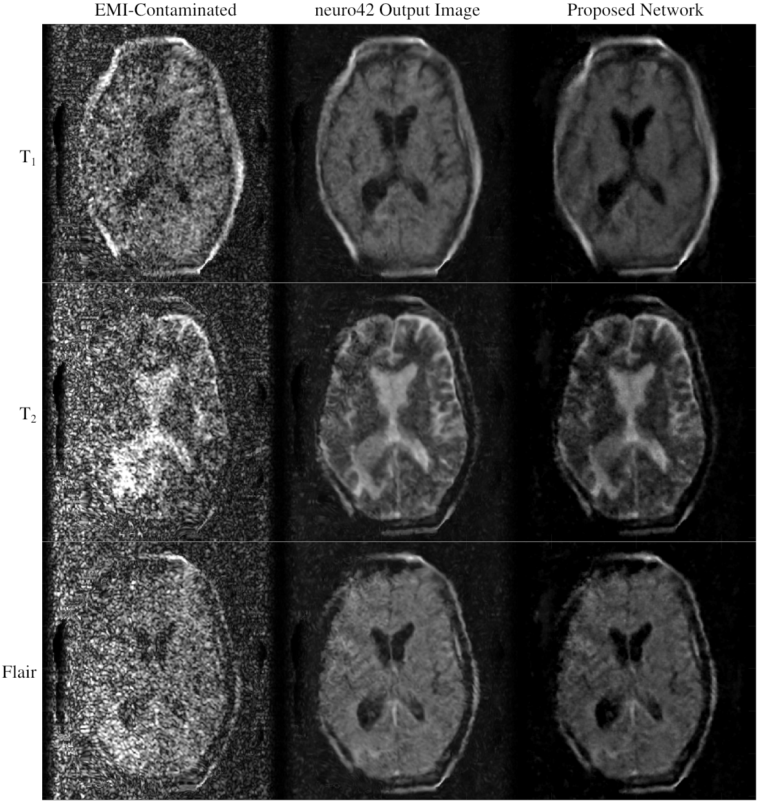  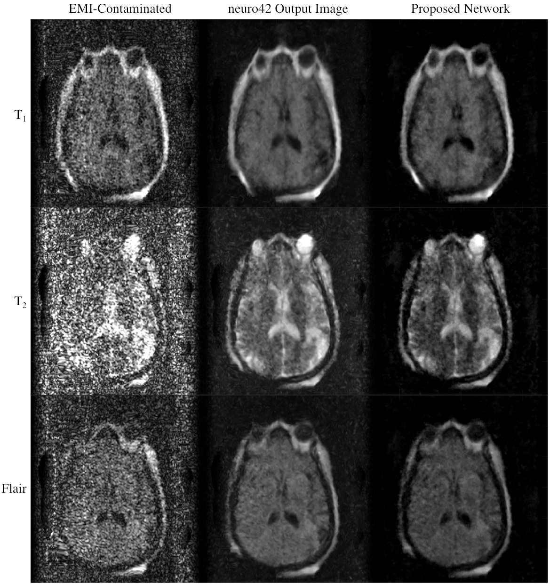 
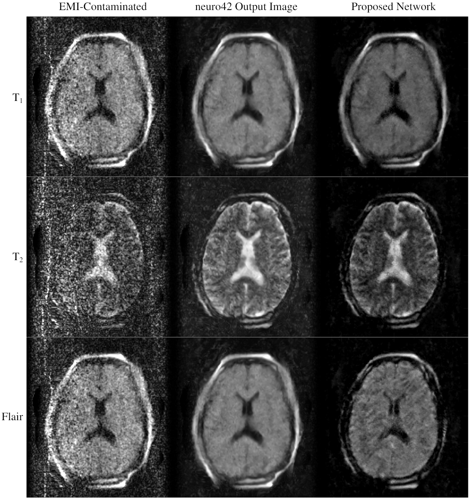  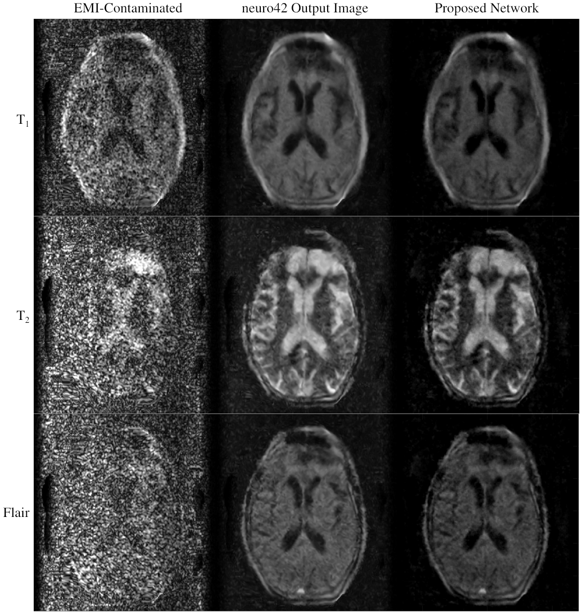  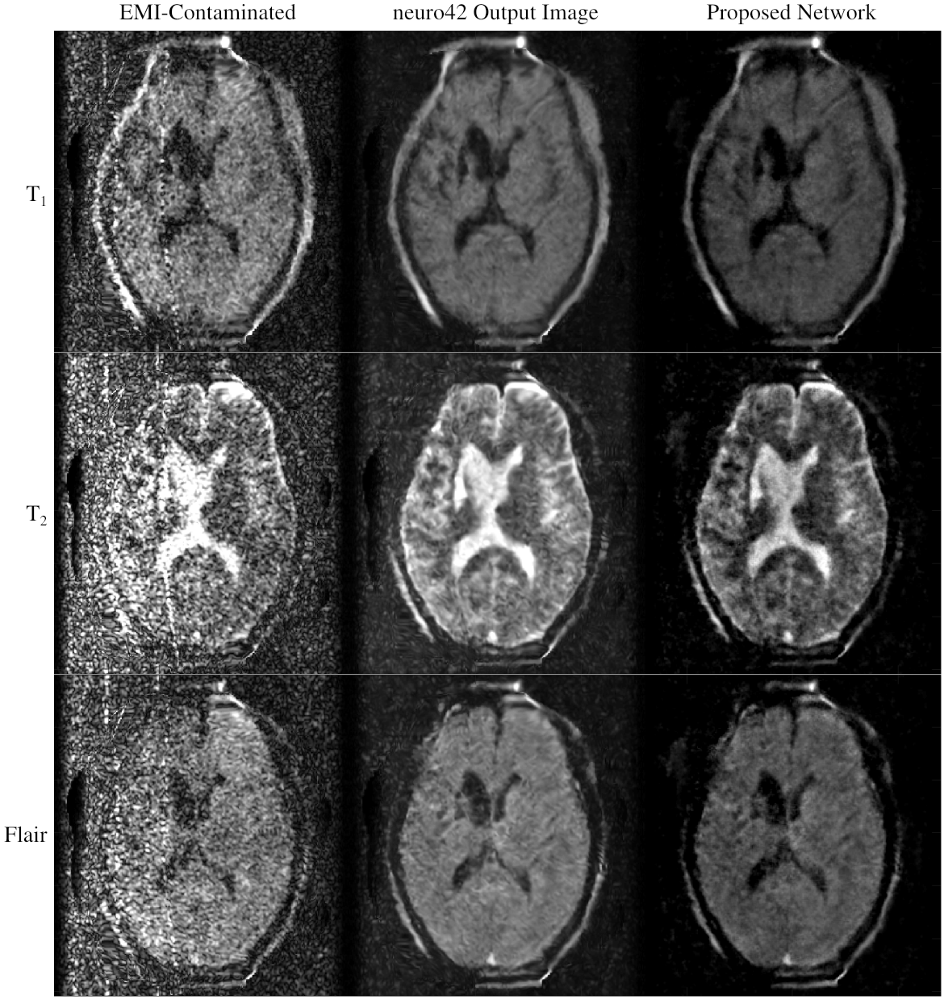 
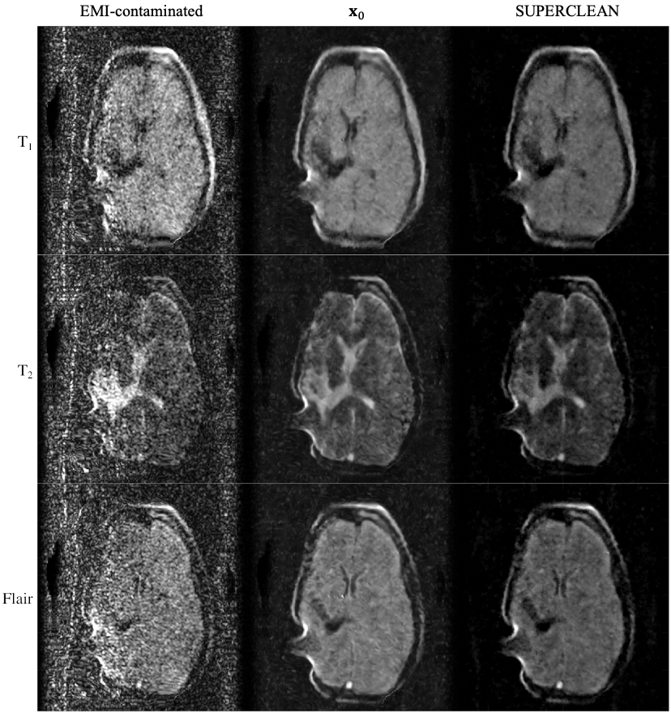  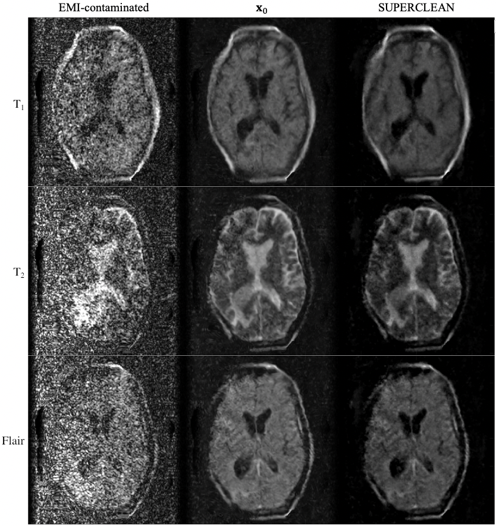 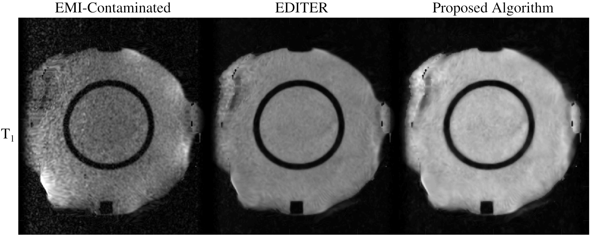 
